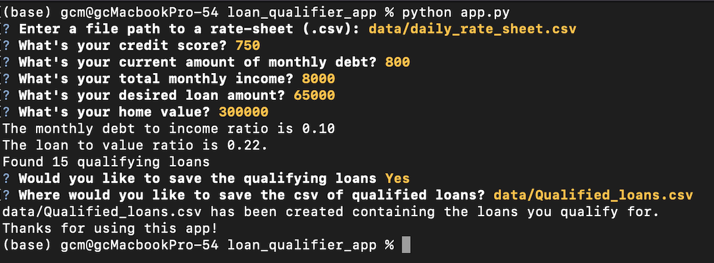

# Loan Qualifier Application

This is a command-line interface application which promts the user to enter credit score, monthly debt, monthly income, desired loan amount, and the value of their house. It then returns a list of loans the user is qualified for, and saves it as a .csv file. The saved location is also input by the user.

---

## Technologies

This project uses these python packages:

* [fire](https://github.com/google/python-fire) - For the command line interface, help page, and entry-point.

* [questionary](https://github.com/tmbo/questionary) - For dialogs that promt user input.

---

## Installation Guide

Before running the application first install the following dependencies.

```python
  pip install fire
  pip install questionary
```

---

## Usage

To use this application: Clone the repository, and in terminal type in:

```python
python app.py
```

If it works the terminal will display the first question, which asks for the user's credit score. The last two step asks the user if they want to save the qualified loans. If the answer is yes, it promts to pick where to save the file as a csv.




---

---

## Contributors

G. Cale McDowell
---

## License


